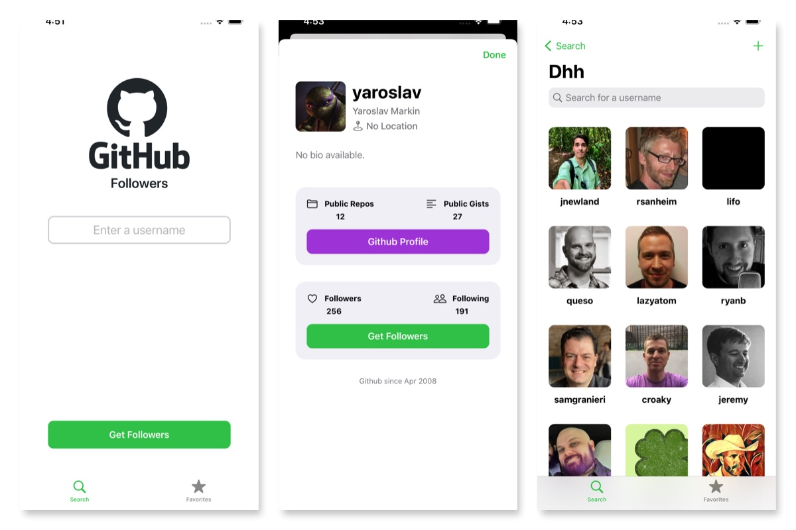

# GHFollowers

GHFollowers is an iOS app that allows the user to search for github users add them to your favorite list and more.

## Concepts included

#### Views
- Programmatic views
- Collection view with pagination and Diffable Data Sources
- Embedded view controllers
- Native image caching with NSCache
- Custom alert view
- Native Dark Mode support
- Dynamic type
- iPhone SE support

#### Architecture
- Delegates and protocols
- Network manager with URLSession and Codable
- Persistence manager for UserDefaults
- Swift 5 result type and error handling
